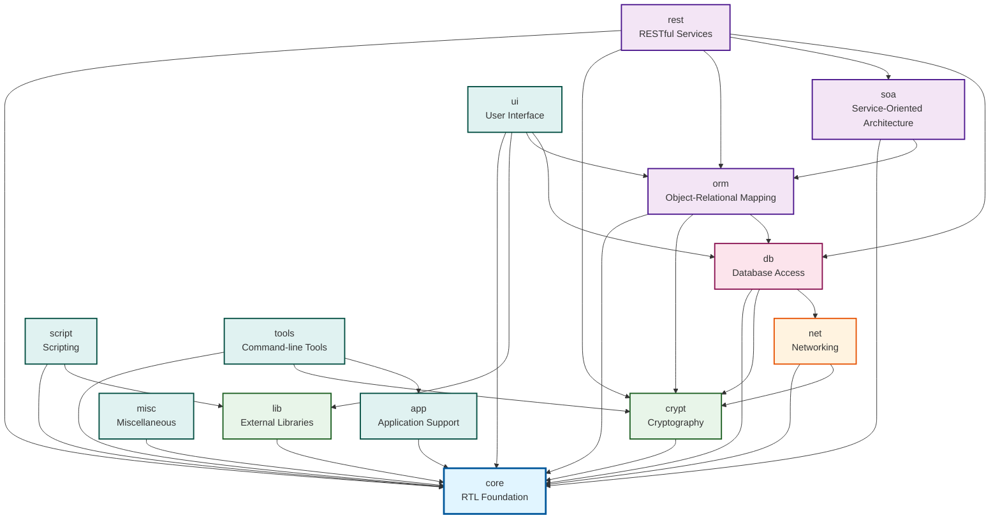

# mORMot2 Source Folder Dependencies

**Generated:** 2025-10-10
**Purpose:** Comprehensive dependency analysis of mORMot2 source folders for build planning and architecture understanding

---

## Executive Summary

mORMot2 follows a **strict layered architecture** with 14 source folders organized in 6 dependency layers. The foundation layer (`core`) has **zero dependencies** on other mORMot folders, while higher layers build progressively on lower ones. No circular dependencies exist.

### Folder Count by Layer
- **Layer 0 (Foundation):** 1 folder (core)
- **Layer 1 (System Libraries):** 2 folders (lib, crypt)
- **Layer 2 (Networking):** 1 folder (net)
- **Layer 3 (Database):** 1 folder (db)
- **Layer 4 (ORM/REST):** 3 folders (orm, rest, soa)
- **Layer 5 (Application):** 6 folders (app, ui, script, misc, tools, ddd)

---

## Layered Architecture Overview

```
┌─────────────────────────────────────────────────────────────┐
│  Layer 5: Application & Tools                               │
│  ┌─────┬─────┬────────┬──────┬───────┬──────┐               │
│  │ app │ ui  │ script │ misc │ tools │ ddd* │               │
│  └─────┴─────┴────────┴──────┴───────┴──────┘               │
└─────────────────────────────────────────────────────────────┘
                           │
┌─────────────────────────────────────────────────────────────┐
│  Layer 4: ORM / REST / SOA                                  │
│  ┌─────┬──────┬─────┐                                       │
│  │ orm │ rest │ soa │                                       │
│  └─────┴──────┴─────┘                                       │
└─────────────────────────────────────────────────────────────┘
                           │
┌─────────────────────────────────────────────────────────────┐
│  Layer 3: Database Access                                   │
│  ┌────┐                                                     │
│  │ db │                                                     │
│  └────┘                                                     │
└─────────────────────────────────────────────────────────────┘
                           │
┌─────────────────────────────────────────────────────────────┐
│  Layer 2: Networking                                        │
│  ┌─────┐                                                    │
│  │ net │                                                    │
│  └─────┘                                                    │
└─────────────────────────────────────────────────────────────┘
                           │
┌─────────────────────────────────────────────────────────────┐
│  Layer 1: System Libraries & Cryptography                   │
│  ┌─────┬────────┐                                           │
│  │ lib │ crypt  │                                           │
│  └─────┴────────┘                                           │
└─────────────────────────────────────────────────────────────┘
                           │
┌─────────────────────────────────────────────────────────────┐
│  Layer 0: Foundation (RTL-Only)                             │
│  ┌──────┐                                                   │
│  │ core │  (24 units - no mormot.* dependencies)            │
│  └──────┘                                                   │
└─────────────────────────────────────────────────────────────┘

* ddd folder contains only documentation (no .pas files)
```

---

## Detailed Dependency Matrix

| Folder   | Layer | Depends On (mORMot folders)                           | File Count | Description |
|----------|-------|-------------------------------------------------------|------------|-------------|
| **core** | 0     | *(none - RTL only)*                                   | 24         | Foundation types, JSON, RTTI, OS abstraction |
| **lib**  | 1     | core                                                  | 14         | External library bindings (zlib, OpenSSL, curl, QuickJS) |
| **crypt**| 1     | core                                                  | 10         | Cryptography (AES, SHA, ECC, RSA, JWT, X.509) |
| **net**  | 2     | core, crypt                                          | 18         | Networking (sockets, HTTP, WebSockets, async) |
| **db**   | 3     | core, crypt, net                                     | 27         | Database access (SQL, NoSQL, RAD adapters) |
| **orm**  | 4     | core, crypt, db                                      | 9          | Object-Relational Mapping |
| **rest** | 4     | core, crypt, orm, soa, db                            | 8          | RESTful services framework |
| **soa**  | 4     | core, orm                                            | 4          | Service-Oriented Architecture (interfaces) |
| **app**  | 5     | core                                                 | 3          | Application-level utilities (console, daemon) |
| **ui**   | 5     | core, lib, orm, db                                   | 6          | VCL/LCL UI components (reports, grids, PDF) |
| **script**| 5    | core, lib                                            | 2          | Scripting engines (QuickJS integration) |
| **misc** | 5     | core                                                 | 2          | Miscellaneous utilities (PE/COFF, ISO) |
| **tools**| 5     | core, crypt, app                                     | 2          | Command-line tools (ecc, mget) |
| **ddd**  | 5     | *(documentation only - no .pas files)*               | 0          | Domain-Driven Design documentation |

---

## Folder-by-Folder Dependency Details

### Layer 0: Foundation

#### **core** (24 files)
- **Dependencies:** None (RTL only: sysutils, classes, variants, typinfo)
- **Key Units:**
  - `mormot.core.base` - Framework version, basic types, RTL functions
  - `mormot.core.os` - Operating system abstraction layer
  - `mormot.core.unicode` - Unicode/UTF-8 text handling
  - `mormot.core.text` - Text processing and formatting
  - `mormot.core.rtti` - Cross-compiler RTTI abstraction
  - `mormot.core.json` - JSON parsing and serialization
  - `mormot.core.data` - Data structures and algorithms
  - `mormot.core.buffers` - Memory buffer management
  - `mormot.core.variants` - Variant type handling
  - `mormot.core.datetime` - Date/time utilities
  - `mormot.core.threads` - Threading primitives
  - `mormot.core.log` - Logging framework
  - `mormot.core.perf` - Performance monitoring
  - `mormot.core.zip` - ZIP compression
  - `mormot.core.interfaces` - Interface handling
  - `mormot.core.search` - Search and filtering
  - `mormot.core.test` - Testing framework
  - `mormot.core.collections` - Generic collections
  - `mormot.core.mustache` - Mustache template engine
  - `mormot.core.mvc` - MVC pattern support
  - `mormot.core.os.security` - OS security features
- **Status:** ✅ Pure RTL - can be compiled standalone
- **Build Order:** 1

---

### Layer 1: System Libraries & Cryptography

#### **lib** (14 files)
- **Dependencies:** core
- **Key Units:**
  - `mormot.lib.z` - zlib/libdeflate compression
  - `mormot.lib.static` - Static library linking support
  - `mormot.lib.openssl11` - OpenSSL 1.1 bindings
  - `mormot.lib.curl` - libcurl HTTP client
  - `mormot.lib.sspi` - Windows SSPI authentication
  - `mormot.lib.gssapi` - POSIX GSSAPI authentication
  - `mormot.lib.pkcs11` - PKCS#11 cryptographic tokens
  - `mormot.lib.quickjs` - QuickJS JavaScript engine
  - `mormot.lib.winhttp` - Windows WinHTTP
  - `mormot.lib.gdiplus` - Windows GDI+ graphics
  - `mormot.lib.uniscribe` - Windows text rendering
  - `mormot.lib.win7zip` - 7-Zip archive support
  - `mormot.lib.zstd` - Zstandard compression
  - `mormot.lib.lizard` - Lizard compression
- **Status:** External library wrappers (no mORMot inter-dependencies)
- **Build Order:** 2

#### **crypt** (10 files)
- **Dependencies:** core
- **Key Units:**
  - `mormot.crypt.core` - AES, SHA-2, SHA-3, HMAC, PBKDF2
  - `mormot.crypt.secure` - Secure random, password hashing
  - `mormot.crypt.ecc` - Elliptic Curve Cryptography
  - `mormot.crypt.ecc256r1` - ECC secp256r1 curve
  - `mormot.crypt.rsa` - RSA encryption/signatures
  - `mormot.crypt.jwt` - JSON Web Tokens
  - `mormot.crypt.x509` - X.509 certificate handling
  - `mormot.crypt.openssl` - OpenSSL wrapper (uses lib.openssl11)
  - `mormot.crypt.pkcs11` - PKCS#11 wrapper (uses lib.pkcs11)
  - `mormot.crypt.other` - Additional crypto algorithms
- **Status:** Self-contained cryptographic layer
- **Build Order:** 2

---

### Layer 2: Networking

#### **net** (18 files)
- **Dependencies:** core, crypt
- **Key Units:**
  - `mormot.net.sock` - Low-level sockets API abstraction
  - `mormot.net.http` - HTTP protocol implementation
  - `mormot.net.client` - HTTP client
  - `mormot.net.server` - HTTP server
  - `mormot.net.async` - Asynchronous I/O
  - `mormot.net.ws.core` - WebSocket core
  - `mormot.net.ws.client` - WebSocket client
  - `mormot.net.ws.server` - WebSocket server
  - `mormot.net.ws.async` - Async WebSocket
  - `mormot.net.dns` - DNS resolution
  - `mormot.net.ldap` - LDAP client
  - `mormot.net.acme` - ACME protocol (Let's Encrypt)
  - `mormot.net.relay` - Network relay/proxy
  - `mormot.net.tunnel` - Network tunneling
  - `mormot.net.tftp.client` - TFTP client
  - `mormot.net.tftp.server` - TFTP server
  - `mormot.net.rtsphttp` - RTSP over HTTP
  - `mormot.net.openapi` - OpenAPI/Swagger support
- **Crypto Usage:** TLS/SSL encryption (uses crypt)
- **Build Order:** 3

---

### Layer 3: Database Access

#### **db** (27 files)
- **Dependencies:** core, crypt (secure), net (proxy), db.core
- **Key Units:**
  - **Core:**
    - `mormot.db.core` - Shared database types and definitions
    - `mormot.db.sql` - Abstract SQL database classes
    - `mormot.db.proxy` - Database proxy/connection pooling
  - **Raw Database Access:**
    - `mormot.db.raw.sqlite3` - SQLite3 API
    - `mormot.db.raw.sqlite3.static` - Static SQLite3 library
    - `mormot.db.raw.postgres` - PostgreSQL API
    - `mormot.db.raw.oracle` - Oracle OCI
    - `mormot.db.raw.odbc` - ODBC API
    - `mormot.db.raw.oledb` - OLE DB API
  - **SQL Database Connectors:**
    - `mormot.db.sql.sqlite3` - SQLite3 SQL connector
    - `mormot.db.sql.postgres` - PostgreSQL SQL connector
    - `mormot.db.sql.oracle` - Oracle SQL connector
    - `mormot.db.sql.odbc` - ODBC SQL connector
    - `mormot.db.sql.oledb` - OLE DB SQL connector
    - `mormot.db.sql.ibx` - InterBase/Firebird IBX
    - `mormot.db.sql.zeos` - Zeos Database Objects
  - **NoSQL:**
    - `mormot.db.nosql.bson` - BSON encoding
    - `mormot.db.nosql.mongodb` - MongoDB client
  - **RAD Studio Components:**
    - `mormot.db.rad` - RAD Studio DB components base
    - `mormot.db.rad.bde` - BDE adapter
    - `mormot.db.rad.firedac` - FireDAC adapter
    - `mormot.db.rad.unidac` - UniDAC adapter
    - `mormot.db.rad.nexusdb` - NexusDB adapter
    - `mormot.db.rad.ui` - UI data-aware components
    - `mormot.db.rad.ui.cds` - ClientDataSet UI
    - `mormot.db.rad.ui.sql` - SQL UI components
    - `mormot.db.rad.ui.orm` - ORM UI components
- **Build Order:** 4

---

### Layer 4: ORM / REST / SOA

#### **orm** (9 files)
- **Dependencies:** core, crypt (secure), db
- **Key Units:**
  - `mormot.orm.base` - ORM low-level types and definitions
  - `mormot.orm.core` - TOrm class, TOrmModel, TOrmTable
  - `mormot.orm.rest` - REST-based ORM client/server base
  - `mormot.orm.client` - ORM client implementation
  - `mormot.orm.server` - ORM server implementation
  - `mormot.orm.storage` - Storage engines abstraction
  - `mormot.orm.sql` - SQL-based ORM
  - `mormot.orm.sqlite3` - SQLite3-specific ORM
  - `mormot.orm.mongodb` - MongoDB ORM
- **Build Order:** 5

#### **soa** (4 files)
- **Dependencies:** core, orm
- **Key Units:**
  - `mormot.soa.core` - Interface-based SOA core types
  - `mormot.soa.client` - SOA client-side
  - `mormot.soa.server` - SOA server-side
  - `mormot.soa.codegen` - Service code generation
- **Build Order:** 5

#### **rest** (8 files)
- **Dependencies:** core, crypt, orm, soa, db
- **Key Units:**
  - `mormot.rest.core` - REST core types and TRest base class
  - `mormot.rest.client` - REST client implementation
  - `mormot.rest.server` - REST server implementation
  - `mormot.rest.http.client` - HTTP REST client
  - `mormot.rest.http.server` - HTTP REST server
  - `mormot.rest.mvc` - Model-View-Controller support
  - `mormot.rest.sqlite3` - SQLite3 REST server
  - `mormot.rest.memserver` - In-memory REST server
- **Note:** Integrates orm, soa, and net layers for complete REST framework
- **Build Order:** 6

---

### Layer 5: Application & Tools

#### **app** (3 files)
- **Dependencies:** core
- **Key Units:**
  - `mormot.app.console` - Console application support (ICommandLine)
  - `mormot.app.daemon` - Daemon/service support
  - `mormot.app.agl` - Application-level abstractions
- **Build Order:** 7

#### **ui** (6 files)
- **Dependencies:** core, lib (gdiplus), orm, db
- **Key Units:**
  - `mormot.ui.core` - VCL/LCL cross-compatibility
  - `mormot.ui.controls` - Custom UI controls
  - `mormot.ui.grid.orm` - ORM-aware grid components
  - `mormot.ui.report` - Reporting engine
  - `mormot.ui.pdf` - PDF generation
  - `mormot.ui.gdiplus` - GDI+ rendering
- **Note:** Requires VCL/LCL (GUI frameworks)
- **Build Order:** 7

#### **script** (2 files)
- **Dependencies:** core, lib (static, quickjs)
- **Key Units:**
  - `mormot.script.core` - Scripting engine abstraction
  - `mormot.script.quickjs` - QuickJS JavaScript engine integration
- **Build Order:** 7

#### **misc** (2 files)
- **Dependencies:** core
- **Key Units:**
  - `mormot.misc.pecoff` - PE/COFF file reader (Windows executables)
  - `mormot.misc.iso` - ISO standards utilities
- **Build Order:** 7

#### **tools** (2 files)
- **Dependencies:** core, crypt, app
- **Key Units:**
  - `mormot.tools.ecc` - ECC command-line tool (certificate management)
  - `mormot.tools.mget` - mget download tool
- **Note:** Executable tools, not libraries
- **Build Order:** 8

#### **ddd** (0 files)
- **Dependencies:** N/A
- **Status:** Documentation-only folder (README.md, CLAUDE.md)
- **Build Order:** N/A

---

## Dependency Graph (Mermaid Format)



---

## Build Order Recommendations

### Recommended Compilation Sequence

1. **core** - Foundation (must be first)
2. **lib** + **crypt** - Can be built in parallel (both depend only on core)
3. **net** - Networking layer (depends on core + crypt)
4. **db** - Database layer (depends on core + crypt + net)
5. **orm** + **soa** - Can be built in parallel (orm depends on db, soa on orm)
6. **rest** - REST framework (depends on orm + soa + db)
7. **app** + **ui** + **script** + **misc** - Can be built in parallel
8. **tools** - Command-line tools (last)

### Parallel Build Strategy

```
Stage 1:  core
          ↓
Stage 2:  lib ║ crypt
          ↓
Stage 3:  net
          ↓
Stage 4:  db
          ↓
Stage 5:  orm ║ soa
          ↓
Stage 6:  rest
          ↓
Stage 7:  app ║ ui ║ script ║ misc
          ↓
Stage 8:  tools
```

**Parallel Stages:** 2, 5, 7 (3 stages can utilize multiple cores)

---

## Circular Dependency Analysis

### Status: ✅ **NO CIRCULAR DEPENDENCIES DETECTED**

The mORMot2 architecture maintains strict layer separation with unidirectional dependencies flowing from higher layers to lower layers. This clean architecture enables:

- **Incremental compilation** - Changes in higher layers don't require rebuilding lower layers
- **Selective deployment** - Applications can include only required layers
- **Modular testing** - Each layer can be tested independently
- **Clear separation of concerns** - Each layer has well-defined responsibilities

### Potential Coupling Points (Not Circular)

1. **orm ↔ rest ↔ soa**: These three folders form the core service architecture but maintain proper layering:
   - `soa` depends on `orm` (interfaces need ORM types)
   - `rest` depends on both `orm` and `soa` (REST integrates both)
   - No backward dependencies

2. **db → net**: Database layer can use network for proxy connections
   - This is a forward dependency only (net doesn't depend on db)

3. **rest → orm → db**: Clear unidirectional flow
   - REST uses ORM
   - ORM uses Database
   - No backward references

---

## Special Considerations

### External Dependencies (Non-mORMot)

All folders depend on **Delphi/FPC RTL** units:
- `sysutils`, `classes`, `variants`, `contnrs`, `typinfo`

Additional external dependencies:
- **ui**: Requires `Graphics`, `Controls`, `Themes` (VCL/LCL)
- **lib**: Links to external libraries (zlib, OpenSSL, curl, etc.)
- **crypt**: May use OpenSSL via `lib.openssl11` (optional)

### Platform-Specific Code

Several folders contain platform-specific implementations:
- **core**: `mormot.core.os` - Windows/POSIX abstraction
- **net**: `mormot.net.sock` - Socket API abstraction (WinSock/BSD)
- **lib**: Windows-only units (sspi, winhttp, gdiplus, uniscribe, win7zip)

### Optional Components

Some units are **optional** depending on project requirements:
- **ui**: Only needed for VCL/LCL GUI applications
- **script**: Only if JavaScript scripting is required
- **tools**: Command-line utilities (not libraries)
- **db.rad.***: Only for RAD Studio component integration
- **db.nosql.***: Only if MongoDB is used
- **net.ws.***: Only if WebSockets are needed

---

## Usage Recommendations

### Minimal Server Application

For a basic REST server with SQLite:

```
Required folders:
1. core      (foundation)
2. crypt     (security)
3. db        (database access - only db.sql.sqlite3)
4. orm       (ORM layer)
5. rest      (REST server)

Optional:
- net (if custom HTTP server needed beyond rest.http.server)
- soa (if interface-based services required)
```

### Full-Featured Client Application

For a GUI client with ORM and services:

```
Required folders:
1. core      (foundation)
2. crypt     (security)
3. net       (networking)
4. db        (database access)
5. orm       (ORM layer)
6. soa       (services)
7. rest      (REST client)
8. ui        (GUI components)
9. app       (application framework)
```

### Cryptographic Tool

For a command-line crypto tool:

```
Required folders:
1. core      (foundation)
2. crypt     (cryptography)
3. app       (console support)
4. tools     (if using mormot.tools.ecc)
```

---

## Key Insights

1. **core is truly foundational** - 24 units with zero mORMot dependencies
2. **lib and crypt are independent** - Both only depend on core (parallel buildable)
3. **net is self-contained** - Networking layer doesn't depend on database/ORM
4. **ORM/REST/SOA form the application core** - Interdependent but properly layered
5. **Application folders are loosely coupled** - Most only depend on core
6. **No framework lock-in** - You can use core/crypt/net without ORM/REST

---

## Maintenance Notes

### When Adding New Units

1. **Determine layer** - Place in appropriate folder based on dependencies
2. **Check dependencies** - Ensure no circular references introduced
3. **Update this document** - Add to dependency matrix
4. **Verify build order** - Confirm compilation sequence still valid

### Refactoring Guidelines

1. **Move dependencies down** - Prefer dependencies on lower layers
2. **Extract to core** - If multiple layers need it, consider moving to core
3. **Avoid cross-layer coupling** - Don't bypass layer boundaries
4. **Keep lib/crypt independent** - These should remain parallel

---

## Document Version History

| Version | Date       | Changes |
|---------|------------|---------|
| 1.0     | 2025-10-10 | Initial comprehensive dependency analysis |

---

**Analyzed by:** Claude Code (Sonnet 4.5)
**Source:** mORMot2 `/mnt/w/mORMot2/src/`
**Method:** Uses clause analysis of representative files from each folder
**Files Analyzed:** 30+ representative .pas files across all folders
